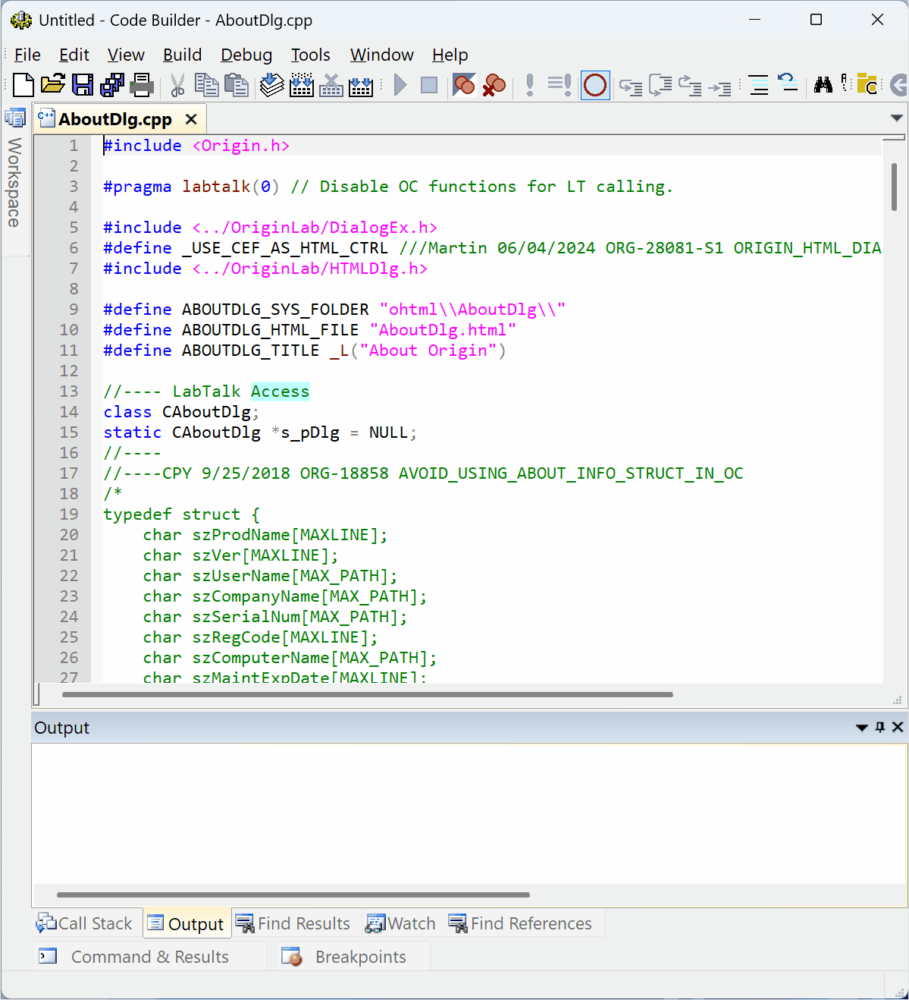
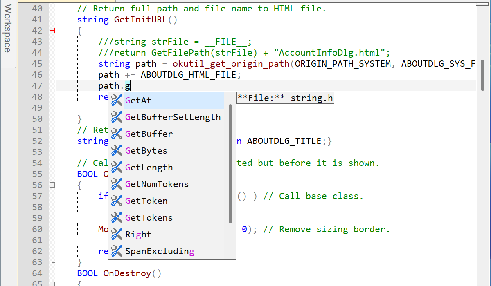
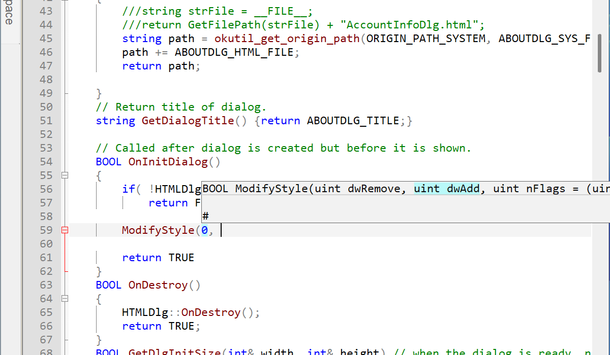
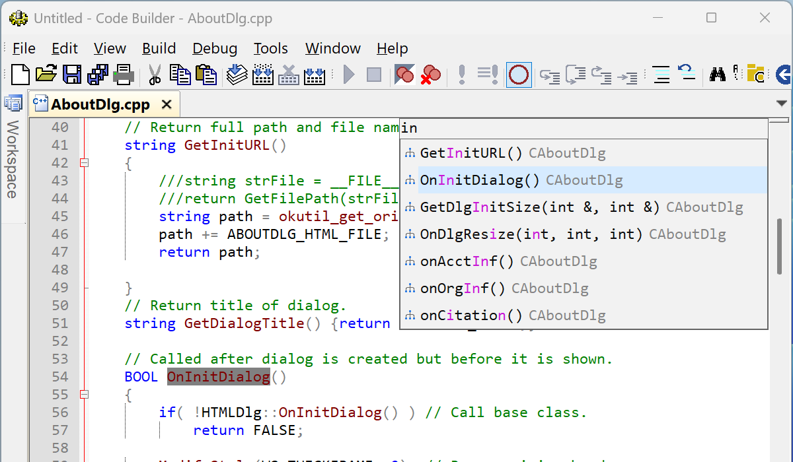
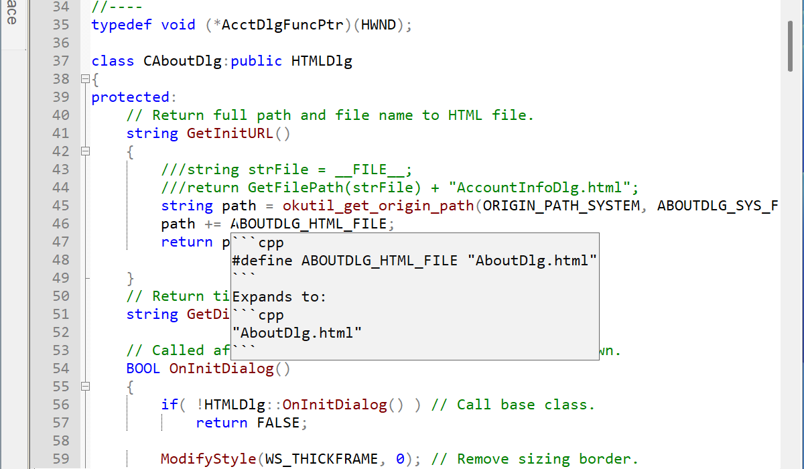

# OCLSP (OriginC Autocomplete)
Language support for OriginC in Code Builder for Origin

Code Builder is the integrated development environment (IDE) built directly into OriginPro and Origin software by OriginLab.

It supports Auto Complete and Go to definition for python script files through [LSP](https://microsoft.github.io/language-server-protocol/), but OriginC is not supported.

This app aims to support OriginC via [cpptools](https://github.com/microsoft/vscode-cpptools).

With the help of cpptools, Code Builder will support:

- Auto Complete
- Go to definition (Press F11 on a symbol)
- Show document when hover on a symbol
- List symbols in active document (Alt+M)
- Find all references to a selected symbol (Shift+Alt+F)

This tool depends on cpptools, a C/C++ Extension for Visual Studio Code by Microsoft.

**Use at your own risks.**

**Please read the license carefully:**

https://marketplace.visualstudio.com/items/ms-vscode.cpptools/license

https://github.com/microsoft/vscode-cpptools/blob/main/RuntimeLicenses/cpptools-LICENSE.txt

https://github.com/microsoft/vscode-cpptools/blob/main/RuntimeLicenses/cpptools-srv-LICENSE.txt




## Auto Complete




## Signature Help




## List symbols in active document (Alt+M)




## Hover symbol info



# How to Use

## Installation

Follow the instructions of the installer, it will show a message about the licenses, please read the licenses carefully, 

The installer will try to locate a copy of the C/C++ extension (cpptools) if it's installed on your computer. Otherwise, it will offer to browse the cpptools.exe, or download one for yourself.

The installer will write some configuration files to your computer so that Origin can be connected to cpptools.

## Uninstallation

The uninstaller will remove the unneeded information from the configuration files and try to remove cache folder generated by cpptools.

# Technical Details

### LSP.json

Origin reads **LSP.json** file for configuration of LSP servers, the installer python script is executed in the process environment of Origin and will try to add an entry to **LSP.json** file with a config for OriginC. When you uninstall the app, it will also remove that entry.

Here's an example of **LSP.json**:

```json
{
    "LSPList": [
        {
            "Lang": 1,
            "Name": "OCLSP_cpptools",
            "Options": {
                "ipc": "stdio",
                "process": {
                    "exe": "D:\\Apps\\Originlab\\2026\\64bit\\PyDLLs\\python.exe",
                    "arg": [
                        "\"D:\\OriginFiles\\apps\\OriginC Autocomplete\\OCLSP.py\"",
                        "\"C:\\Users\\Kenny\\.vscode\\extensions\\ms-vscode.cpptools-1.29.3-win32-x64\\bin\\cpptools.exe\""
                    ],
                    "env": {
                        "PYTHONPATH": "D:\\Apps\\Originlab\\2026\\python311.zip;D:\\Apps\\Originlab\\2026\\python311.zip\\site-packages;D:\\Apps\\Originlab\\2026\\64bit\\PyDLLs;C:\\ProgramData\\OriginLab\\103\\PyPackage\\Py3",
                        "PYTHONHOME": "D:\\Apps\\Originlab\\2026\\64bit\\PyDLLs",
                        "OCLSP_TRACE": false,
                        "OCLSP_LOG": false,
                        "OCLSP_CONFIG_JSON_PATH": "C:\\Users\\Kenny\\AppData\\Local\\OriginLab\\Apps\\OCLSP.json",
                        "ORGDIR_EXE": "D:\\Apps\\Originlab\\2026\\",
                        "ORGDIR_UFF": "D:\\UFF\\",
                        "ORGDIR_USER_APPDATA": "C:\\Users\\Kenny\\AppData\\Local\\OriginLab\\103\\",
                        "ORG_VER": 10.300086
                    }
                }
            }
        }
    ]
}
```

Notice the **"Lang" : 1** there is for OriginC language.

Origin will then know it should launch the exe path (python.exe), the command line arguments (python script path of **OCLSP.py**), and the necessary environment variables and the expected method of communication (in this case, stdio). 

If you set **OCLSP_LOG** as true, the script (**OCLSP.py**) writes log messages to a file named **oclsp_proxy.log**, which can be located at AppData folder, e.g.:

*C:\Users\Kenny\AppData\Local\OriginLab\103\OCLSP\oclsp_proxy.log*

Setting **OCLSP_TRACE** as true will output debug messages that can be viewed in real time by a tool **DbgView**.

OCLSP.py reads an additional config file named OCLSP.json, as shown above in the LSP.json example.

### OCLSP.json

Here's an example of OCLSP.json:

```json
{
    "cpptools": "C:\\Users\\Kenny\\.vscode\\extensions\\ms-vscode.cpptools-1.29.3-win32-x64\\bin\\cpptools.exe",
    "installed_orgin_lsp": [
        {
            "config": "D:\\UFF\\LSP.json",
            "storage": "C:\\Users\\Kenny\\AppData\\Local\\OriginLab\\103\\OCLSP\\storage"
        }
    ],
    "workspaceFolders": [
        {
            "uri": "C:\\Users\\Kenny\\AppData\\Local\\OriginLab\\Apps",
            "name": "app"
        }
    ]
}
```

If you need to work on multiple folder in Code Builder, you may add additional workspace folder, as shown above.
